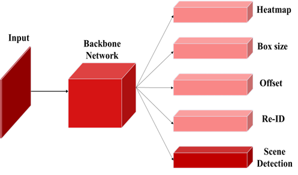

# FairMOT-Scene-detection

## Introduction
    
In swimming competition video, there are some scenes that repeatly occured when swimmers do competition.     
We classified some scenes - On-block, Diving, Swimming, Turning, Finish.    
Optimized hyper-parameters were different for each classes, so to utilize this we added classification head to FairMOT.    
After classification head classified scene classes, hyper-parameters are changed by each optimized values for classes.     
We increase swimmer tracking persistance and MOTA score maximum 5.2% than before not used classification head.    

Swimming scene detection dataset

https://drive.google.com/drive/folders/1hpA_zdLswchUfw2x6N9jMzboc-paiNw-?usp=drive_link

Swimming pretrained models (FairMOT, Scene detection FairMOT head)

https://drive.google.com/drive/folders/1OUAETnTg0SkwO5NA7QIU3t3F4I9QIRYI?usp=drive_link
